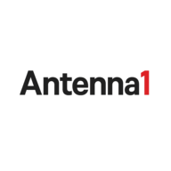

# Media Streaming App



## Descrizione

Media Streaming App è un'applicazione web progressiva (PWA) che consente agli utenti di ascoltare stazioni radio e guardare canali Twitch in un'unica interfaccia elegante e intuitiva. L'applicazione è completamente responsive e può essere installata su dispositivi mobili e desktop per un accesso rapido e offline.

## Caratteristiche Principali

- 🎵 Streaming di stazioni radio
- 📺 Integrazione con canali Twitch
- 🌓 Tema chiaro/scuro/automatico
- 🌍 Supporto multilingua (Italiano, Inglese)
- 📱 Installabile come PWA (Progressive Web App)
- 🔄 Funzionalità offline tramite Service Worker
- 🐳 Containerizzazione con Docker

## Tecnologie Utilizzate

- React.js
- Styled Components
- i18next per la localizzazione
- Service Worker per funzionalità offline
- Docker per la containerizzazione

## Requisiti di Sistema

- Node.js 14.x o superiore
- npm 6.x o superiore
- Docker e Docker Compose (per l'esecuzione containerizzata)

## Installazione e Avvio

### Sviluppo Locale

1. Clona il repository:
   ```bash
   git clone <url-repository>
   cd radio-app
2. Installa le dipendenze:

   bash
   Run
   npm install
3. Avvia l'applicazione in modalità sviluppo:

   bash
   Run
   npm start
4. L'applicazione sarà disponibile all'indirizzo http://localhost:3000.

   Utilizzo con Docker
5. Costruisci e avvia i container:

   bash
   Run
   docker-compose up -d
6. L'applicazione sarà disponibile all'indirizzo http://localhost.

7. Per fermare i container:

   bash
   Run
   docker-compose down
## Struttura del Progetto
   radio-app/
    ├── public/                # File statici e manifest PWA
    │   ├── index.html        # Template HTML principale
    │   ├── manifest.json     # Manifest per PWA
    │   └── service-worker.js # Service Worker per funzionalità offline
    ├── src/
    │   ├── components/       # Componenti React
    │   ├── config/           # Configurazioni dell'applicazione
    │   ├── locales/          # File di traduzione
    │   │   ├── it/           # Traduzioni in italiano
    │   │   └── en/           # Traduzioni in inglese
    │   ├── theme/            # Configurazione dei temi
    │   └── App.js            # Componente principale
    ├── Dockerfile            # Configurazione per l'immagine Docker
    ├── docker-compose.yml    # Configurazione Docker Compose
    └── README.md             # Documentazione del progetto
## Funzionalità
   ### Selezione delle Stazioni
   L'applicazione permette di filtrare e selezionare tra diverse stazioni radio e canali Twitch. Ogni stazione è rappresentata da una card con logo e nome.

   ### Player Multimediale
   Il player integrato supporta sia stream audio (per le radio) che video (per i canali Twitch), con controlli per la riproduzione e il volume.

   ### Temi
   L'applicazione supporta tre modalità di tema:

   Chiaro: Interfaccia luminosa per l'uso diurno
   Scuro: Interfaccia scura per ridurre l'affaticamento degli occhi
   Auto: Cambia automaticamente in base alle preferenze del sistema
   ### Localizzazione
   L'interfaccia è disponibile in italiano e inglese, con rilevamento automatico della lingua del browser.

   ### Installazione come PWA
   Gli utenti possono installare l'applicazione sui loro dispositivi tramite il pulsante "Installa App" che appare quando l'applicazione è visitata da un browser compatibile.

   ##Contribuire al Progetto
   Le contribuzioni sono benvenute! Per contribuire:

   1. Fai un fork del repository
   2. Crea un branch per la tua feature (git checkout -b feature/nome-feature)
   3. Committa le tue modifiche (git commit -m 'Aggiungi nuova feature')
   4. Pusha al branch (git push origin feature/nome-feature)
   5. Apri una Pull Request
   
   ## Licenza
   Questo progetto è distribuito con licenza MIT. Vedi il file LICENSE per maggiori dettagli.

   ## Contatti
   Per domande o supporto, contattare il team di sviluppo all'indirizzo email@esempio.com.

   © 2023 Media Streaming App. Tutti i diritti riservati.